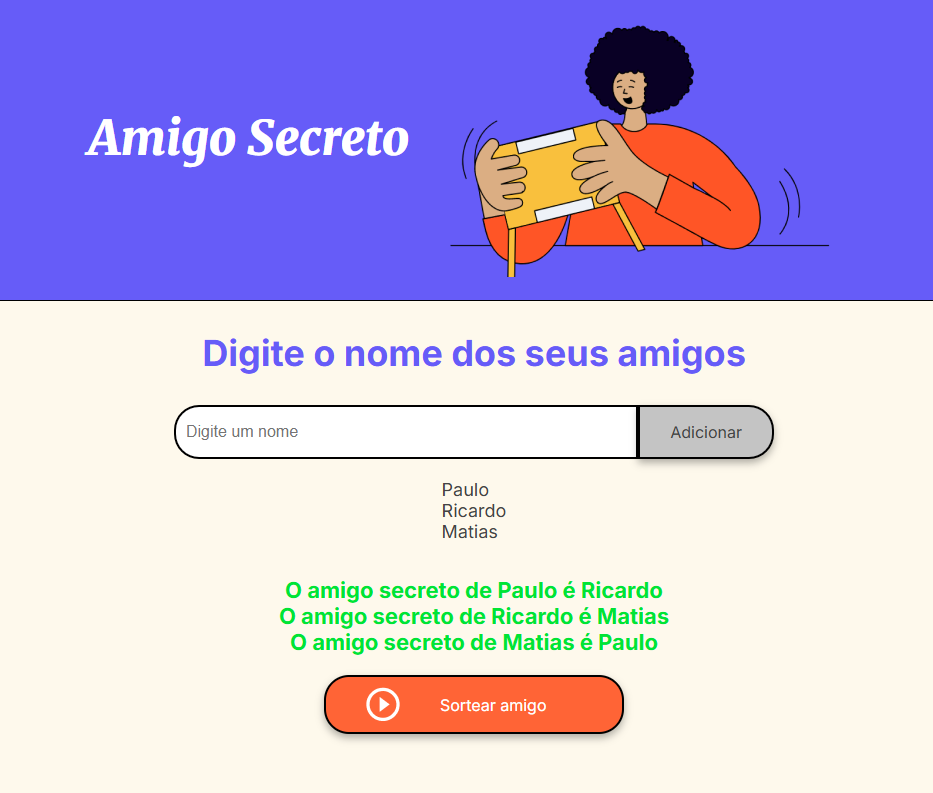

# Projeto Amigo Secreto

Este é um projeto simples e divertido para realizar um sorteio de amigo secreto de forma digital.  
A aplicação permite que você adicione o nome dos participantes e, com um clique, realize o sorteio de forma aleatória, garantindo que ninguém tire a si mesmo.

---

## 🎯 Funcionalidades
- **Adicionar Participantes**: Inclua o nome de todos os amigos que irão participar do sorteio. O sistema impede a adição de nomes duplicados e campos vazios.  
- **Listar Nomes**: À medida que os nomes são adicionados, eles são exibidos em uma lista na interface.  
- **Sorteio Aleatório**: Ao clicar no botão **"Sortear amigo"**, a aplicação embaralha a lista e cria pares aleatórios, exibindo o resultado imediatamente.  
- **Validação de Sorteio**: O algoritmo garante que nenhum participante seja sorteado para si mesmo. Caso isso aconteça, um novo sorteio é realizado automaticamente.  
- **Interface Intuitiva**: O design simples e direto torna a utilização fácil para qualquer pessoa.  

---

## 🚀 Como usar
Siga os passos abaixo para realizar seu sorteio de amigo secreto:

1. Abra o arquivo **`index.html`** em seu navegador web.  
2. **Adicione os nomes**: Digite o nome de cada participante no campo de texto e clique no botão **"Adicionar"**. Os nomes serão listados abaixo.  
3. **Realize o sorteio**: Após adicionar todos os participantes (mínimo de dois), clique no botão **"Sortear amigo"**.  
4. **Visualize o resultado**: A aplicação irá exibir a lista de quem tirou quem.  

---

## 📸 Capturas de tela
- **Adicionando nomes:**  
*(insira aqui a imagem da tela de adição de nomes)*  

- **Resultado do sorteio:**  
 

---

## 📂 Estrutura do Projeto
O projeto é composto por três arquivos principais:

- **`index.html`** → Estrutura principal da página web.  
- **`style.css`** → Folha de estilo para o design e layout da interface.  
- **`app.js`** → Arquivo JavaScript que contém a lógica para adicionar nomes, embaralhar a lista e exibir o resultado do sorteio.  

---

## 🤝 Como contribuir
Sinta-se à vontade para clonar o repositório e melhorar o projeto.  
Sugestões de melhorias incluem:

- Adicionar uma opção para **"resetar"** o sorteio.  
- Melhorar a validação e a interface para casos de erro.  
- Tornar a aplicação mais **responsiva** para diferentes dispositivos.  

---
